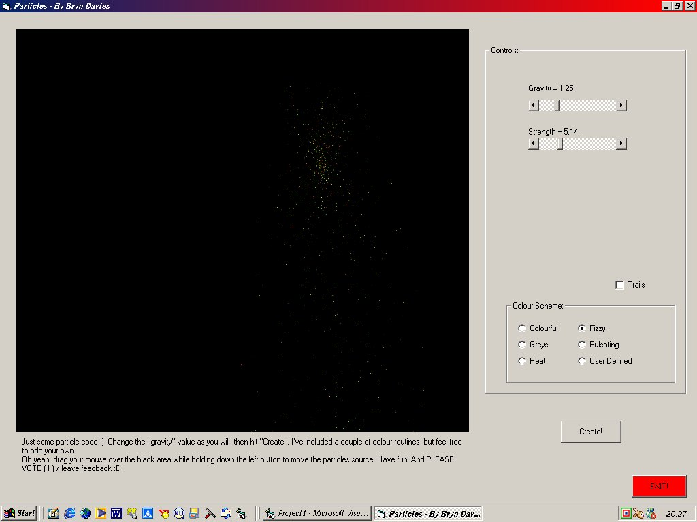



## particle stuffs

### Description

Generates real-time particles that are affected by gravity and their own energy. Play around with these options, as well as various colour effect including heat, fizzy and user-defined. Pretty fast too, considering it uses pset (Will use setpixel when I add extra elements such as bouncing) as well as auto redraw. Please leave comments/vote.

You can change the source of the fountain-type effect by dragging the mouse. Very easy to understand code. Demonstrates Select Case, Option and Check boxes, pset and point and circle methods. (The color selector is not visible in the screenshot but has a useful "ring" feature that may be useful in a paint program.

Also alows trails...
 
### More Info
 

             |
---                |---
**Submitted On**   |2002-06-05 21:07:56
**By**             |[Bryn Davies](https://github.com/Planet-Source-Code/PSCIndex/blob/master/ByAuthor/bryn-davies.md)
**Level**          |Intermediate
**User Rating**    |4.8 (91 globes from 19 users)
**Compatibility**  |VB 5\.0, VB 6\.0
**Category**       |[Graphics](https://github.com/Planet-Source-Code/PSCIndex/blob/master/ByCategory/graphics__1-46.md)
**World**          |[Visual Basic](https://github.com/Planet-Source-Code/PSCIndex/blob/master/ByWorld/visual-basic.md)
**Archive File**   |[particle\_s90673652002\.zip](https://github.com/Planet-Source-Code/bryn-davies-particle-stuffs__1-35504/archive/master.zip)

